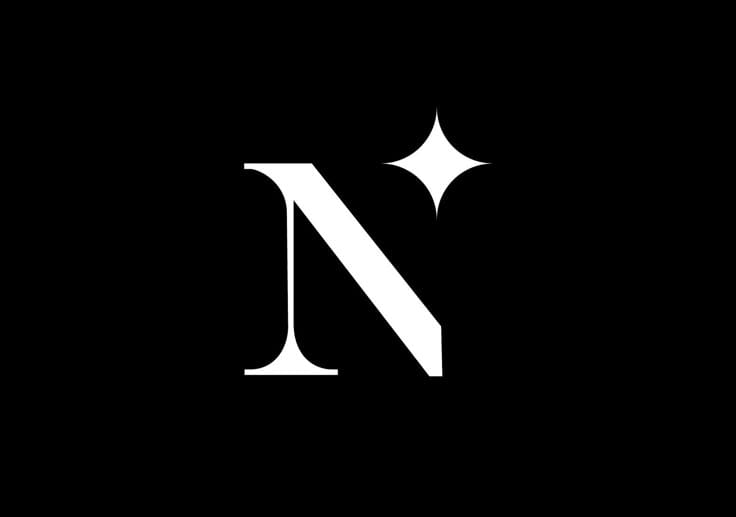

<div align="center">
  
  <h1>Naveen R's Portfolio</h1>
  <p><strong>A Product-Grade Developer Portfolio for an AI/ML Engineer</strong></p>
  
  [](https://nextjs.org/)
  [](https://tailwindcss.com/)
  [](https://www.framer.com/motion/)
  [](https://www.typescriptlang.org/)
</div>

<br />

## 🚀 Overview

This repository contains the source code for an advanced, highly-interactive, product-grade developer portfolio built specifically to showcase Naveen R's work in Artificial Intelligence, Machine Learning, and Full-Stack Engineering.

Designed to rival the high-end product websites of companies like Vercel, Linear, and Apple, this portfolio features a deep dark mode aesthetic, smooth glassmorphism, precise typography, and a myriad of immersive micro-interactions powered by Framer Motion.

## ✨ Elite Features

- **The Nexus Card:** A unique, interactive, physical-feeling modal ID card with spring physics that houses social and professional links.
- **Interactive Terminal:** A fully integrated Hacker/Developer terminal mode. Visitors can type commands like `help`, `projects`, `skills`, and `about` to navigate the portfolio.
- **AI Portfolio Assistant:** A custom floating chatbot that answers visitors' questions about Naveen's background, technologies, and projects in real time.
- **Magnetic Buttons:** Custom cursor-aware buttons that leverage physics to gently pull themselves towards the user's mouse pointer upon hovering.
- **Dynamic Custom Cursor:** A sleek, glowing orb cursor that dynamically scales and adjusts its opacity based on the interactable elements beneath it.
- **Real-Time Currently Building State:** A dedicated showcase highlighting ongoing developments (like an AI Resume Analyzer and ML Model Dashboard) with pulsating "In Development" status indicators.
- **Ultra-Fast Single-Line Marquee:** A visually impressive rapid-scrolling tech stack carousel using incredibly high-res logos.
- **Hardware Accelerated Glassmorphism:** Optimized radial-gradient glow effects acting as backdrop blurs for 60fps scrolling on any modern device.

## 🛠️ Technology Stack

| Category | Technologies |
| --- | --- |
| **Framework** | Next.js (App Router), React 19 |
| **Language** | TypeScript |
| **Styling** | Tailwind CSS (v3.4) |
| **Animation** | Framer Motion |
| **Icons & Assets** | Custom SVGs, Wikimedia, Devicons |

## 🏗️ Project Structure

```bash
portfolio-next/
├── public/                 # Static assets (images, CV, certificates, icons)
├── src/
│   ├── app/                # Next.js App Router (page.tsx, layout.tsx, globals.css)
│   ├── components/         # Modular UI Components
│   │   ├── Chatbot.tsx              # Interactive Assistant
│   │   ├── TerminalMode.tsx         # CLI Simulator
│   │   ├── Magnetic.tsx             # Physics Element wrapper
│   │   ├── CustomCursor.tsx         # Dynamic glowing cursor
│   │   ├── NexusCard.tsx            # Digital ID Card
│   │   ├── HeroSection.tsx          # Cinematic landing section
│   │   ├── ProjectsSection.tsx      # Glassmorphic Project Showcase
│   │   ├── CurrentlyBuildingSection.tsx # In-Dev Projects
│   │   ├── SkillsSection.tsx        # High-speed infinite marquee
│   │   ├── CertificationsSection.tsx# Academic credentials
│   │   └── ContactSection.tsx       # Bottom CTA and Contacts
```

## 💻 Running Locally

1. **Clone the repository:**
   ```bash
   git clone https://github.com/nav-in27/Website-Portfolio.git
   ```

2. **Navigate to the portfolio directory:**
   ```bash
   cd Website-Portfolio/portfolio-next
   ```

3. **Install dependencies:**
   ```bash
   npm install
   ```

4. **Start the development server:**
   ```bash
   npm run dev
   ```

5. **View the application:**
   Open `http://localhost:3000` in your web browser.

## 🎨 Design Philosophy

This project abandons standard "student-developer portfolio" templates in favor of a **Cinematic Product Landing Page** style. It leverages:
- **`#0f0f0f` Backgrounds** for maximum OLED depth.
- **`#ff5a3c` Glowing Accents** to draw the user's eye natively.
- **Inter & Poppins Fonts** to balance readability with bold structural headings.

## 📬 Contact & Links

- **LinkedIn:** [naveen-r-19a160326](https://linkedin.com/in/naveen-r-19a160326)
- **GitHub:** [nav-in27](https://github.com/nav-in27)
- **Email:** [naveenrenugopal@gmail.com](mailto:naveenrenugopal@gmail.com)

---
<p align="center">
  <i>Designed & Built by Naveen R.</i>
</p>
